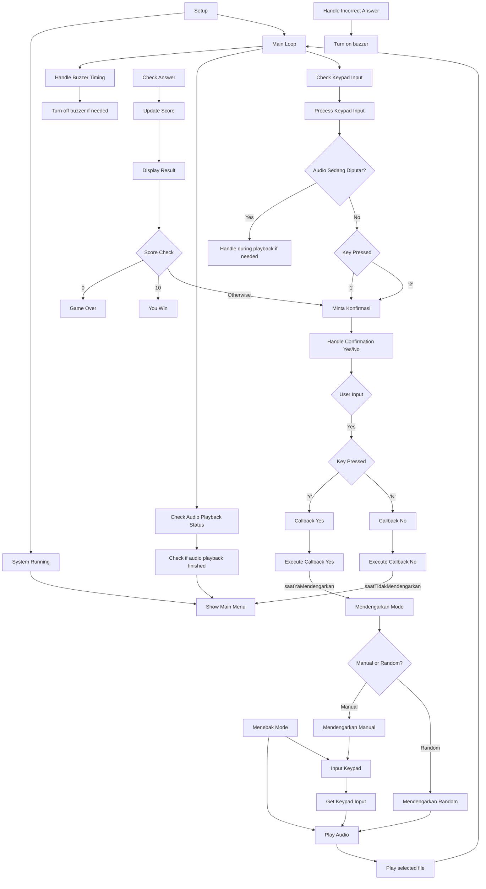

```mermaid
graph TD
    A[Setup]
    B[Main Loop]
    C[Handle Buzzer Timing]
    D[Check Audio Playback Status]
    E[Check Keypad Input]
    F[Process Keypad Input]
    G[Show Main Menu]
    H[Mendengarkan Mode]
    I[Menebak Mode]
    J[Minta Konfirmasi]
    K[Handle Confirmation Yes/No]
    L[Mendengarkan Manual]
    M[Mendengarkan Random]
    N[Play Audio]
    O[Input Keypad]
    P[Check Answer]
    Q[Update Score]
    R[Display Result]
    S[System Running]
    T[Handle Incorrect Answer]
    
    A --> S
    S --> G
    A --> B
    B --> C
    B --> D
    B --> E
    C --> C1[Turn off buzzer if needed]
    D --> D1[Check if audio playback finished]
    D1 --> G
    E --> F
    F --> F1{Audio Sedang Diputar?}
    F1 -- Yes --> F2[Handle during playback if needed]
    F1 -- No --> F3{Key Pressed}
    F3 -- '1' --> J
    F3 -- '2' --> J
    J --> K
    K --> K1{User Input}
    K1 -- Yes --> K2{Key Pressed}
    K2 -- 'Y' --> K3[Callback Yes]
    K2 -- 'N' --> K4[Callback No]
    K3 --> K5[Execute Callback Yes]
    K4 --> K6[Execute Callback No]
    K5 -- saatYaMendengarkan --> H
    K6 -- saatTidakMendengarkan --> G
    H --> H1{Manual or Random?}
    H1 -- Manual --> L
    H1 -- Random --> M
    L --> O
    M --> N
    N --> N1[Play selected file]
    N1 --> B
    O --> O1[Get Keypad Input]
    O1 --> N
    I --> N
    I --> O
    P --> Q
    Q --> R
    R --> R1{Score Check}
    R1 -- 0 --> R2[Game Over]
    R1 -- 10 --> R3[You Win]
    R1 -- Otherwise --> J
    T --> T1[Turn on buzzer]
```