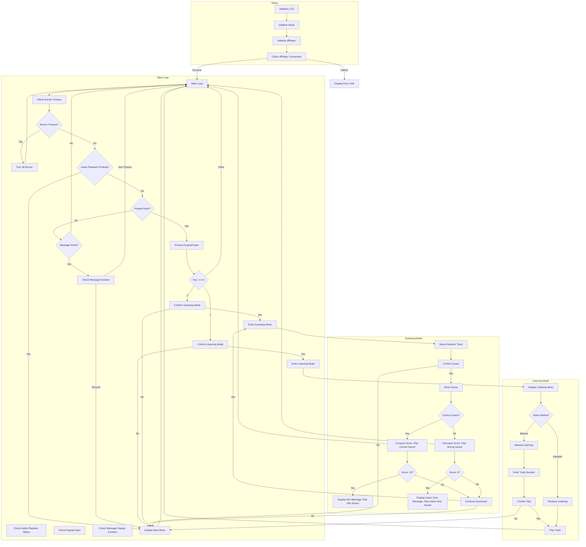

```mermaid
flowchart TD
    subgraph Setup
        A1[Initialize LCD]
        A2[Initialize Serial]
        A3[Initialize dfPlayer]
        A4[Check dfPlayer Connection]
        A1 --> A2 --> A3 --> A4
    end
    A4 -->|Success| B[Main Loop]
    A4 -->|Failure| A5[Display Error, Halt]

    subgraph Main Loop
        B1[Check Buzzer Timeout]
        B2[Check Audio Playback Status]
        B3[Check Keypad Input]
        B4[Check Message Display Duration]
        B --> B1 --> C{Buzzer Timeout?}
        C -->|Yes| D[Turn off Buzzer]
        C -->|No| E{Audio Playback Finished?}
        E -->|Yes| F[Display Main Menu]
        E -->|No| G{Keypad Input?}
        G -->|Yes| H[Process Keypad Input]
        G -->|No| I{Message Active?}
        I -->|Yes| J[Check Message Duration]
        J -->|Timeout| F
        J -->|Not Timeout| B
        I -->|No| B
        H --> K{Key: 1 or 2}
        K -->|1| L[Confirm Listening Mode]
        K -->|2| M[Confirm Guessing Mode]
        K -->|Other| B
        L -->|Yes| N[Enter Listening Mode]
        L -->|No| F
        M -->|Yes| O[Enter Guessing Mode]
        M -->|No| F
    end

    subgraph Listening Mode
        N1[Display Listening Menu]
        N2{Select Method}
        N --> N1 --> N2
        N2 -->|Manual| Q[Manual Listening]
        N2 -->|Random| R[Random Listening]
        Q --> S[Enter Track Number]
        S --> T[Confirm Play]
        T -->|Yes| U[Play Track]
        T -->|No| F
        R --> U
    end

    subgraph Guessing Mode
        O1[Select Random Track]
        O2[Confirm Guess]
        O --> O1 --> O2
        O2 -->|Yes| X[Enter Guess]
        O2 -->|No| F
        X --> Y{Correct Guess?}
        Y -->|Yes| Z[Increase Score, Play Correct Sound]
        Y -->|No| AA[Decrease Score, Play Wrong Sound]
        Z --> AB{Score: 10?}
        AB -->|Yes| AC[Display Win Message, Play Win Sound]
        AB -->|No| AD[Continue Guessing?]
        AD -->|Yes| O
        AD -->|No| F
        AA --> AE{Score: 0?}
        AE -->|Yes| AF[Display Game Over Message, Play Game Over Sound]
        AE -->|No| AD
    end

    F[Display Main Menu] --> B
    D --> B
    U --> B
    Z --> B
    AA --> B
```