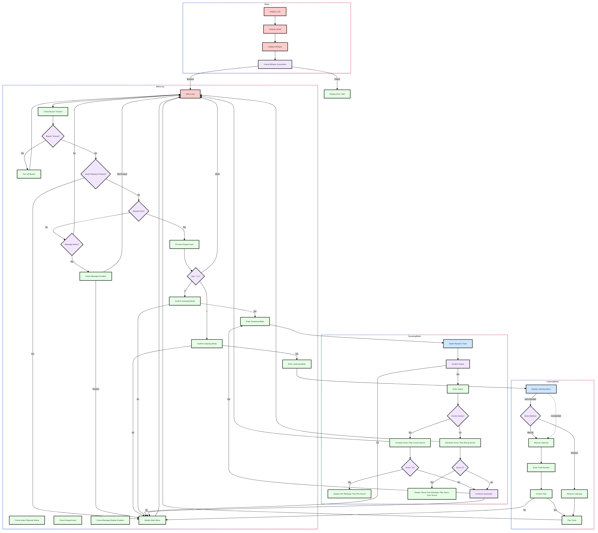
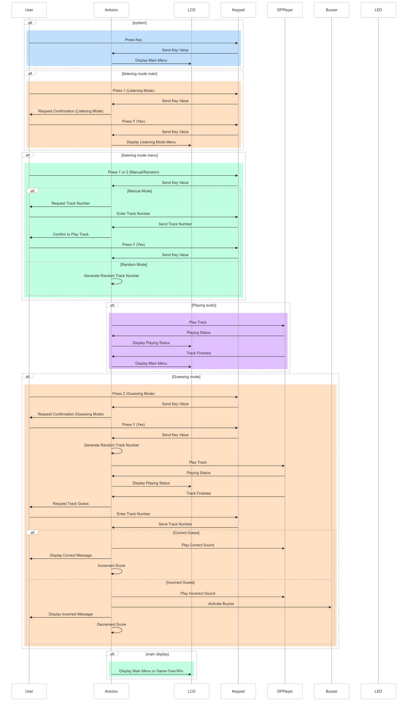

# Permainan Tebak Ayat Interaktif

## Gambaran Umum

Proyek ini adalah sistem berbasis Arduino sederhana untuk mendengarkan dan menebak ayat-ayat Al-Qur'an. Sistem ini menggunakan LCD, keypad, modul MP3 DFPlayer Mini, buzzer, dan amplifier audio dengan speaker. Pengguna dapat memilih untuk mendengarkan ayat secara acak atau dengan memilih nomor tertentu, lalu menebak ayat yang didengar. Sistem ini melacak skor pengguna dan memberikan umpan balik melalui layar LCD dan buzzer.

## Komponen yang Digunakan

- **Arduino Board** (misalnya, Arduino Uno)
- **LiquidCrystal_I2C**: Layar LCD (20x4)
- **Keypad**: Keypad 3x4
- **DFRobotDFPlayerMini**: Modul pemutar MP3
- **Buzzer**
- **LED**
- **Audio Amplifier Module**
- **Speaker**
- **Kartu SD**: Berisi file audio (001.wav hingga 286.wav)
- **Kabel dan Breadboard**

## Diagram Rangkaian

### Koneksi

| Komponen          | Arduino Pin       |
|-------------------|-------------------|
| **Layar LCD**     |                   |
| SDA               | A4                |
| SCL               | A5                |
| **Keypad**        |                   |
| Pin baris 1       | Pin digital 9     |
| Pin baris 2       | Pin digital 8     |
| Pin baris 3       | Pin digital 7     |
| Pin kolom 1       | Pin digital 6     |
| Pin kolom 2       | Pin digital 5     |
| Pin kolom 3       | Pin digital 4     |
| Pin kolom 4       | Pin digital 3     |
| **DFPlayer Mini** |                   |
| RX                | Pin digital 10    |
| TX                | Pin digital 11    |
| VCC               | 5V                |
| GND               | GND               |
| SPK1              | Audio input+ (Amplifier)|
| SPK2              | Audio input- (Amplifier)|
| **Audio Amplifier Module**|           |
| Audio Input+      | SPK1 (DFPlayer Mini)|
| Audio Input-      | SPK2 (DFPlayer Mini)|
| Audio Output+     | Speaker+          |
| Audio Output-     | Speaker-          |
| VCC               | 5V                |
| GND               | GND               |
| **Buzzer**        |                   |
| Positif           | Pin digital 51    |
| Negatif           | GND               |
| **LED**           |                   |
| Positif           | Pin digital 2     |
| Negatif           | GND               |

## Instalasi dan Pengaturan

1. **Install Arduino IDE**: Unduh dan instal Arduino IDE dari [situs web Arduino](https://www.arduino.cc/en/Main/Software).
2. **Instalasi Perpustakaan**:
   - Buka Arduino IDE.
   - Pergi ke **Sketch** -> **Include Library** -> **Manage Libraries**.
   - Instal perpustakaan berikut:
     - **Wire** (Biasanya sudah terinstal)
     - **LiquidCrystal_I2C**
     - **Keypad**
     - **DFRobotDFPlayerMini**

3. **Unggah Kode**:
   - Buka kode Arduino yang disediakan (`ayat-guessing-game.ino`) di Arduino IDE.
   - Hubungkan papan Arduino ke komputer Anda.
   - Pilih papan dan port yang sesuai dari menu **Tools**.
   - Klik tombol **Upload**.

4. **Siapkan Kartu SD**:
   - Format kartu SD ke FAT32.
   - Salin file audio (001.wav hingga 286.wav) ke direktori root kartu SD.
   - Masukkan kartu SD ke modul DFPlayer Mini.

## Cara Menggunakan

1. **Nyalakan Sistem**:
   - Hubungkan Arduino ke sumber daya (USB atau catu daya eksternal).
   - Sistem akan melakukan inisialisasi, dan LCD akan menampilkan menu utama.

2. **Menu Utama**:
   - LCD akan menampilkan "Selamat Datang!" dan meminta pengguna untuk memilih mode permainan:
     - Tekan `1` untuk masuk ke mode **Dengar Ayat**.
     - Tekan `2` untuk masuk ke mode **Tebak Ayat**.

3. **Dengar Ayat**:
   - Sistem akan menanyakan apakah Anda ingin memilih track secara manual atau acak (jika mode extended diaktifkan):
     - Tekan `1` untuk input manual: Sistem akan meminta nomor ayat.
     - Tekan `2` untuk memilih secara acak: Sistem akan memilih ayat secara acak.
   - Konfirmasikan pilihan Anda dengan menekan `Y` (Ya) atau batalkan dengan menekan `N` (Tidak).
   - Ayat yang dipilih akan diputar, dan LCD akan menampilkan statusnya.

4. **Tebak Ayat**:
   - Sistem akan memilih ayat secara acak untuk ditebak.
   - Setelah mendengarkan, Anda akan diminta untuk menebak nomor ayat.
   - Masukkan tebakan Anda menggunakan keypad dan konfirmasi.

5. **Skor**:
   - Tebakan yang benar meningkatkan skor Anda sebesar 1.
   - Tebakan yang salah mengurangi skor Anda sebesar 1 dan memicu buzzer.
   - Permainan berlanjut hingga skor Anda mencapai 0 (Permainan Selesai) atau 10 (Anda Menang).

## Penjelasan Kode

### Variabel dan Konstanta

- `LiquidCrystal_I2C lcd(0x27, 20, 4)`: Inisialisasi LCD dengan alamat I2C 0x27 dan dimensi 20x4.
- `Keypad keypad = Keypad(makeKeymap(keys), rowPins, colPins, ROWS, COLS)`: Inisialisasi keypad.
- `const char* trackNames[]`: Array nama track dari 001.wav hingga 286.wav.
- `const int ledPin = 2`, `const int buzzerPin = 51`: Penugasan pin untuk LED dan buzzer.
- `int skor = 5`: Skor awal.
- `int nomorFile`: Variabel untuk menyimpan nomor file saat ini.
- `bool audioSedangDiputar = false`: Flag untuk memeriksa apakah audio sedang diputar.

### Fungsi Setup

- Menginisialisasi LCD, komunikasi serial, dan mengatur mode pin.
- Memeriksa apakah DFPlayer Mini terhubung dan memulai sistem.

### Fungsi Loop

- Menangani waktu buzzer dan status pemutaran audio dengan menggunakan `millis()` untuk non-blocking delays.
- Memeriksa input keypad dan memprosesnya sesuai kebutuhan.

### Fungsi

- `tampilkanMenuUtama()`: Menampilkan menu utama di LCD.
- `modeMendengarkan()`: Menangani mode mendengarkan.
- `mendengarkanManual()`: Menangani mode mendengarkan manual.
- `mendengarkanRandom()`: Menangani mode mendengarkan acak.
- `modeMenebak()`: Menangani mode menebak.
- `mintaKonfirmasi()`: Menampilkan pesan konfirmasi dan menunggu input dari pengguna.
- `dapatkanInputKeypad()`: Mendapatkan input dari keypad.
- `saatYaMendengarkan()`, `saatTidakMendengarkan()`, `saatYaMenebak()`, `saatTidakMenebak()`, `saatPutarFile()`, `saatTebakanJawaban()`: Fungsi callback untuk menangani input pengguna dan logika permainan.
- `tampilkanPesan(const char*)`: Menampilkan pesan di LCD untuk durasi tertentu menggunakan `millis()`.

## Pemecahan Masalah

- **LCD tidak menampilkan dengan benar**:
  - Periksa alamat I2C dan koneksi.
  - Pastikan perpustakaan LCD terinstal dengan benar.
- **DFPlayer Mini tidak terdeteksi**:
  - Periksa koneksi dan kartu SD.
  - Pastikan file audio diberi nama dengan benar dan ditempatkan di direktori root.
- **Buzzer tidak berfungsi**:
  - Periksa koneksi pin.
  - Pastikan pin buzzer ditugaskan dengan benar dalam kode.
- **Speaker tidak menghasilkan suara**:
  - Periksa koneksi antara DFPlayer Mini dan modul amplifier.
  - Pastikan speaker terhubung dengan benar ke modul amplifier.

## Peningkatan di Masa Depan

- Tambahkan lebih banyak mode permainan atau tantangan.
- Implementasikan fitur tambahan seperti batas waktu atau petunjuk.
- Tingkatkan antarmuka pengguna dan mekanisme umpan balik.

## Flowchart dan Usecase Sequence

